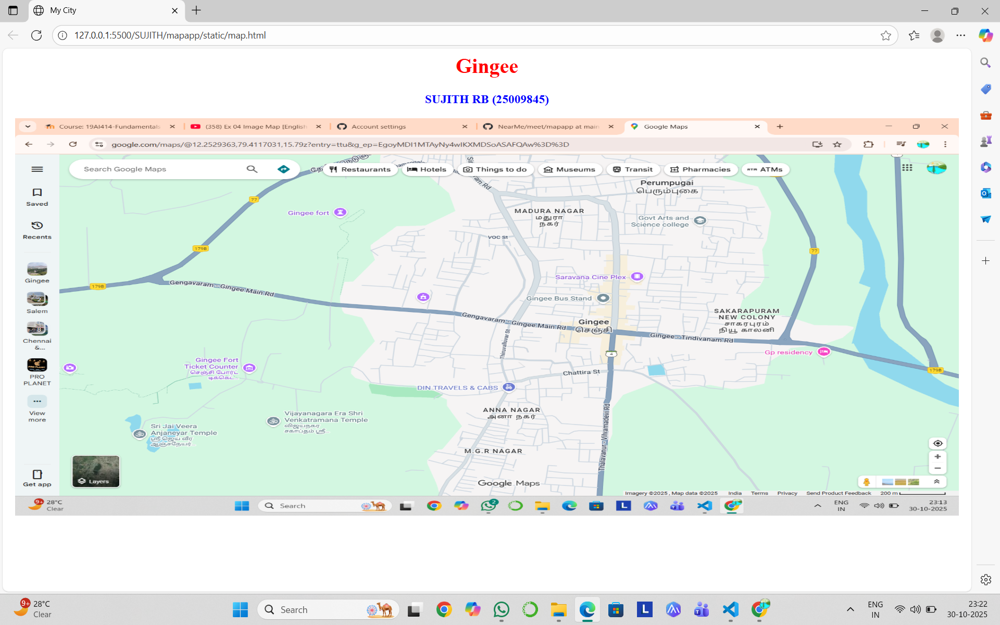
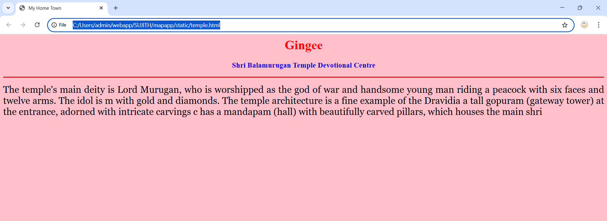
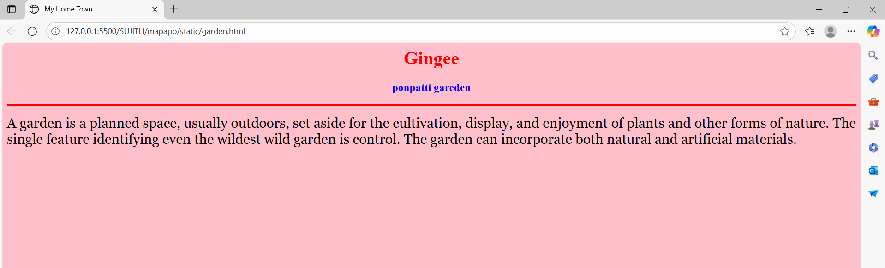
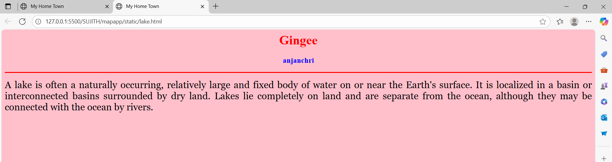
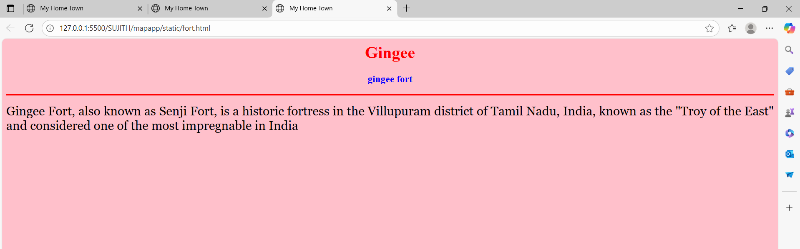
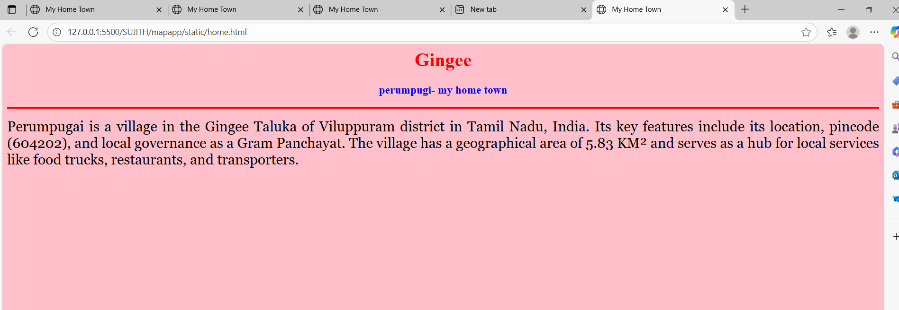

# Ex04 Places Around Me
## Date: 30-10-25

## AIM
To develop a website to display details about the places around my house.

## DESIGN STEPS

### STEP 1
Create a Django admin interface.

### STEP 2
Download your city map from Google.

### STEP 3
Using ```<map>``` tag name the map.

### STEP 4
Create clickable regions in the image using ```<area>``` tag.

### STEP 5
Write HTML programs for all the regions identified.

### STEP 6
Execute the programs and publish them.

## CODE
```
map.html

<html>
<head>
<title>My City</title>
</head>
<body>
<h1 align="center">
<font color="red"><b>Gingee</b></font>
</h1>
<h3 align="center">
<font color="blue"><b>shivaji (25018038)</b></font>
</h3>
<center>

<map name="MyCity">
<area shape="rect" coords="100,100,900,900" href="home.html" title="My Home Town">
<area shape="circle" coords="570,230,45" href="temple.html" title="bala murgan">
<area shape="rect" coords="640,200,30" href="lake.html" title="Anjanchri">
<area shape="rect" coords="1120,360,20" href="gareden.html" title="ponpatti">
<area shape="rect" coords="950,120,1100,140" href="fort.html" title="gingee fort">
</map>
</center>
</body>
</html>

home.html

<html>
<head>
<title>My Home Town</title>
</head>
<body bgcolor="pink">
<h1 align="center">
<font color="red"><b>Gingee</b></font>
</h1>
<h3 align="center">
<font color="blue"><b>perumpugi- my home town</b></font>
</h3>
<hr size="3" color="red">
<p align="justify">
<font face="Georgia" size="5">
Perumpugai is a village in the Gingee Taluka of Viluppuram district
in Tamil Nadu, India. Its key features include its location, pincode (604202),
and local governance as a Gram Panchayat. The village 
has a geographical area of 5.83 KM²
and serves as a hub for local services like food trucks, restaurants, and transporters. 
</p>
</body>
</html>

temple.html

<html>
<head>
<title>My Home Town</title>
</head>
<body bgcolor="pink">
<h1 align="center">
<font color="red"><b>Gingee</b></font>
</h1>
<h3 align="center">
<font color="blue"><b>Shri Balamurugan Temple Devotional Centre</b></font>
</h3>
<hr size="3" color="red">
<p align="justify">
<font face="Georgia" size="5">
The temple's main deity is Lord Murugan, who is worshipped as the god of war
and handsome young man riding a peacock with six faces and twelve arms. The idol
is m with gold and diamonds. The temple architecture is a fine example of the Dravidia a
tall gopuram (gateway tower) at the entrance, adorned with intricate carvings c has a mandapam (hall) 
with beautifully carved pillars, which houses the main shri
</p>
</body>
</html>

gareden.html

<html>
<head>
<title>My Home Town</title>
</head>
<body bgcolor="pink">
<h1 align="center">
<font color="red"><b>Gingee</b></font>
</h1>
<h3 align="center">
<font color="blue"><b>ponpatti gareden</b></font>
</h3>
<hr size="3" color="red">
<p align="justify">
<font face="Georgia" size="5">
A garden is a planned space, usually outdoors, set aside for the cultivation,
display, and enjoyment of plants and other forms of nature. The single feature
identifying even the wildest wild garden is control. The garden can incorporate 
both natural and artificial materials.
</p>
</body>
</html>

lake.html

<html>
<head>
<title>My Home Town</title>
</head>
<body bgcolor="pink">
<h1 align="center">
<font color="red"><b>Gingee</b></font>
</h1>
<h3 align="center">
<font color="blue"><b>anjanchri </b></font>
</h3>
<hr size="3" color="red">
<p align="justify">
<font face="Georgia" size="5">
A lake is often a naturally occurring, relatively large and fixed body of water on or near the Earth's surface.
It is localized in a basin or interconnected basins surrounded by dry land.
Lakes lie completely on land and are separate from the ocean, although they may be connected with the ocean by rivers.
</p>
</body>
</html>

fort.html

<html>
<head>
<title>My Home Town</title>
</head>
<body bgcolor="pink">
<h1 align="center">
<font color="red"><b>Gingee</b></font>
</h1>
<h3 align="center">
<font color="blue"><b> gingee fort </b></font>
</h3>
<hr size="3" color="red">
<p align="justify">
<font face="Georgia" size="5">
Gingee Fort, also known as Senji Fort, is a historic fortress in the Villupuram district of Tamil Nadu, 
India, known as the "Troy of the East" and considered one of the most impregnable in India
</p>
</body>
</html>
```

## OUTPUT








## RESULT
The program for implementing image maps using HTML is executed successfully.
